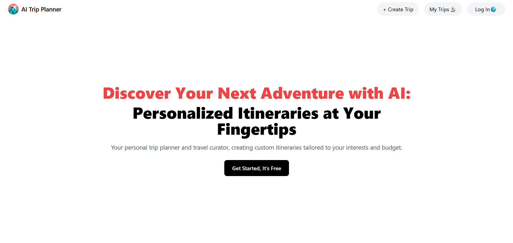

# 🌍 Trip Planner (MERN + AI)

**🚀Live Demo:** [https://trip-planner-6z69.onrender.com](https://trip-planner-6z69.onrender.com)

An **AI-powered trip planner** built with the **MERN stack** that helps users create personalized travel itineraries based on their preferences such as destination, budget, trip duration, and travel companions. Perfect for travelers who want **instant, tailored travel plans** without spending hours researching.

---

## ✨ Features
- **🔐 User Authentication** – Secure Register, Login, Logout using HTTP-only cookies.
- **🤖 AI Trip Generator** – Creates detailed itineraries with activities, recommendations, and day-by-day plans.
- **📂 Trip Management** – Save, view, and delete your planned trips anytime.
- **📱 Responsive UI** – Optimized for mobile, tablet, and desktop.
- **☁️ Fully Deployed** – Hosted on Render with a connected backend and database.
- **⚡ Fast Performance** – Built with Vite for speedy builds and optimized loading.

---

## 🛠 Tech Stack
**Frontend:** React + Vite, Tailwind CSS  
**Backend:** Node.js, Express.js, MongoDB  
**AI:** Google Gemini API  
**Authentication:** JWT + HTTP-only cookies  
**Deployment:** Render  

---

## 📖 Overview
This app allows users to:
1. **Sign up or log in** securely.
2. **Enter trip details** (destination, budget, number of days, companions).
3. **Generate AI-based itineraries** instantly.
4. **Save trips** to their account for later reference.
5. **Manage trips** – edit or delete as needed.

---

## ⚙️ How It Works
1. **User Input** – You fill in your trip preferences.
2. **AI Processing** – The backend sends data to **Google Gemini API** for itinerary generation.
3. **Data Storage** – MongoDB stores your trip details securely.
4. **User Dashboard** – View, manage, or delete trips anytime.

---

## 🚀 Possible Future Enhancements
- 🗺 **Interactive Maps** integration.
- 📍 **Real-time weather updates** for destinations.
- 🏨 **Hotel & flight booking suggestions**.
- 🗣 **Multi-language support** for global users.
- 📤 **Share trips with friends** via links or social media.

---

## 📸 Screenshots
### Home Page

### Trip Creation

---

## 📜 License
MIT License © 2025 Rohan Rajak
